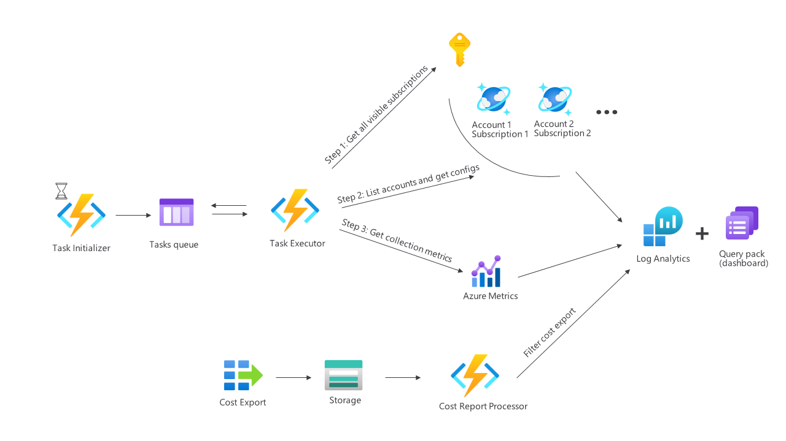

#Azure Cosmos DB Watcher

    

Azure Cosmos DB Watcher is a scraper tool that helps provide visibility into your sprawling Cosmos DB estate. It periodically collects metrics, configuration, and cost data and presents it a single dashboard. Cosmos DB Watcher can be used to understand which Cosmos DB accounts and containers drive most of the cost, or where opportunities to optimize for performance or cost lie. It is not intended to be a solution for real-time monitoring/alerting on production issues.

##Motivation
Telemetry data within Azure Metrics, billing data in Cost Management, or container and account configuration data directly in Cosmos DB are all incredibly useful to understanding how well one's Cosmos DB accounts are tuned. There is currently no place in Azure Portal that would aggregate all the these data sources, present a combined view, and do so at scale across multiple Azure subscriptions. Moreover, for tracking purposes, it would very useful to not just have such a combined view available as of right now, but be able to also compare across days, weeks, and months. After thorough evaluation, we concluded that in order to meet all these requirements a custom monitoring solution would be needed. The key design considerations for the new solution were:
* scalability - see data across hundreds of subscriptions, accounts, and thousands of containers
* detailed cost - cost and performance are tightly related but seeing cost at the container level is not currently possible in Cost Management
* new insights - provide new calculated metrics that are not currently available in Azure Portal or Cosmos DB Metrics/Insights view
* temporal view - offer temporal view to assess how one's Cosmos DB fleet evolves over time
* low cost - be extremely low cost so even customers with smaller Cosmos DB footprints would not be discouraged from deploying this scraper and dashboard
* tight permissions - only provide Control Plane-level permissions to enable deployment in enterprise production environments

##Architecture

This solution relies heavily on Storage queues and Azure Functions for scalability and to keep costs at a minimum. For reference, during testing we monitored 2 subscriptions with 25 Cosmos DB accounts and a total of about 100 container for period of one month. Every day the processing took <2 minutes and the cost incurred for the whole month for all components of this solution was less than $1.

On a high level, there are three main steps. Firstly, once per day a timer-triggered `TaskInitializer` function submits a message onto the `Tasks queue` kick-starting the whole process. Next, `TaskExecutor` function queries for all visible Azure subscriptions, lists all Cosmos DB accounts, databases, and collections within these subscriptions and collects their configuration. It stores the data in associated Log Analytics workspace. As `TaskExecutor` completes each task (e.g., listing accounts within a subscription), it emits a message onto the `Tasks queue`, which triggers another instance of `TaskExecutor`. In essence, this creates a sort of self-propelling loop but with a terminating condition as there is finite number of accounts to be processed and/or failures that may happen. Initial design separated each task into a separate function, but it created challenges where we needed to establish the same client needed to communicate with Azure Control Plane in every function and doing so at a high rate led to timeouts. In this revised and simpler design, we benefit more from client reuse across separate invocations of Azure Functions. Lastly, `TaskExecutor` scrapes requests, storage, and throughput related metrics for each collection and also stores the output within Log Analytics.

In a separate flow, a blob-triggered `CostReportProcessor` function parses a CSV file that is automatically landed by Cost Export in Storage account. The CSV file includes billing data for all services provisioned in a given monitored Azure subscription and `CostReportProcessor` filters only rows relevant to Cosmos DB. Same as in the other flows, the resulting cost data is persisted within Log Analytics workspace. A clean up process leveraging Lifecycle Management Policy is set up to prevent accumulation of processed CSV files in Storage account.

##Install
1) Create a new Resource group
2) Storage Account
    * Create a new Storage Account v2
    * Create a Storage queue named `tasks`
    * Create a Blob container named `costexport`
    * Create a Lifecycly management rule
      * Give the rule any name and specify to `Limit blobs with filters`
      * On next screen, set if condition to "Last modified more than 1 days ago" and keep the then clause to "Delete the blob".
      * Lastly, set blob prefix filter as `costexport/`.
3) Cost Export
    * For every subscription you wish to monitor, navigate to Cost Analysis >> Configure subscription >> Exports and create new Cost Export.
    * Specify Export type as `Daily export of month-to-date costs` and point to previously created Storage account and Blob container. For directory specify `costexport`.
4) Azure Function
    * Create a new Linux Serverless Function App leveraging the previously created Storage account
    * Enable System Managed Identity on the Function App
    * Assign subscription-level `Reader` permission for every subscription you wish to monitor to the Function Managed Identity
    * Assign resource group-level `Monitoring Metrics Publisher` permission to the Function Managed Identity
5) Log Analytics
    * Create a new Log Analytics workspace
    * Navigate to Usage and estimated costs tab and change data retention to 2 years 
    * Create a Data Collection Endpoint by navigating to Azure Monitor >> Data Collection Endpoints >> Create
    * Return to Log Analytics workspace, navigate to Tables and click on Create (New DCR-based log)
      * Specify table name as `DatabaseAccountsConfig_V2`, provide any name for Data Collection Rule, and specify Data Collection Endpoint created in previous step. On next step, upload [this](assets/schemas/schema_DatabaseAccountsConfig_V2_CL.json) schema file.
      * Repeat the above step for table names - `DatabasesConfig_V2`, `ContainersConfig_V2`, `ContainersMetrics`, and `CostData`. Please ensure you select the appropriate schema file for each table.
    * Previous step will create both a custom table within Log Analytics as well as Data Collection Rule for each table. Navigate to your resource group, click on each collection rule, open it in JSON view and take a note of `immutableId` parameter (it is of the form "dcr-randomGuid") along with the `name` of the collection rule.
6) Configure and deploy the solution
    * Git clone this repo
    * Navigate to Configuration section of your Azure Function in Azure Portal and create the following configs:
        | Config Name | Config Value |
        | --- | --- |
        | `AzureMonitorDataCollectionEndpoint` | `https://your_data_collection_endpoint.ingest.monitor.azure.com` |
        | `AzureMonitorDataCollectionRuleIdDatabaseAccountsConfig` | `dcr-randomGuid` |
        | `AzureMonitorDataCollectionStreamNameDatabaseAccountsConfig` | `Custom-DatabaseAccountsConfig_V2_CL` |
        | `AzureMonitorDataCollectionRuleIdDatabasesConfig` |  `dcr-randomGuid` |
        | `AzureMonitorDataCollectionStreamNameDatabasesConfig` | `Custom-DatabasesConfig_V2_CL` |
        | `AzureMonitorDataCollectionRuleIdContainersConfig` | `dcr-randomGuid` |
        | `AzureMonitorDataCollectionStreamNameContainersConfig` | `Custom-ContainersConfig_V2_CL` |
        | `AzureMonitorDataCollectionRuleIdContainersMetrics` | `dcr-randomGuid` |
        | `AzureMonitorDataCollectionStreamNameContainersMetrics` | `Custom-ContainersMetrics_CL` |
        | `AzureMonitorDataCollectionRuleIdCostData` | `dcr-randomGuid` |
        | `AzureMonitorDataCollectionStreamNameCostData` | `Custom-CostData_CL` |
    * Deploy code in this repo to your Azure Function. You can, for example, leverage [Visual Studio Code publish](https://learn.microsoft.com/en-us/azure/azure-functions/functions-develop-vs-code?tabs=python#republish-project-files) wizard, or your preferred CI/CD tool.
    * Once code is deployed, nothing will happen as the application is configured to run at 1am UTC. You can manually trigger it by navigating to your Azure Function >> selecting `TaskInitializer` function >> Code + Test >> Test/Run >> clicking Run in pop up window that opens.
7) Wait for Function to scrape telemetry and look at dashboard
    * (Optional) Create a Log Analytics query pack
    * Navigate to your Log Analytics workspace and copy-paste code for [overview dashboard](dashboards/overview.kql) and explore the data. If you created a query pack in previous step, you can also persist this query for quick re-use in the future by clicking on Save and selecting your query pack.

*Note: Future iteration will provide a one-click deploy ARM template for the above steps.*

##Contributing
If you would like to contribute to this sample, see [CONTRIBUTING.MD](CONTRIBUTING.MD).

This project has adopted the [Microsoft Open Source Code of Conduct](https://opensource.microsoft.com/codeofconduct/). For more information, see the [Code of Conduct FAQ](https://opensource.microsoft.com/codeofconduct/faq/) or contact [opencode@microsoft.com](mailto:opencode@microsoft.com) with any additional questions or comments.

##License
MIT. Copyright &copy; Microsoft Corporation.
